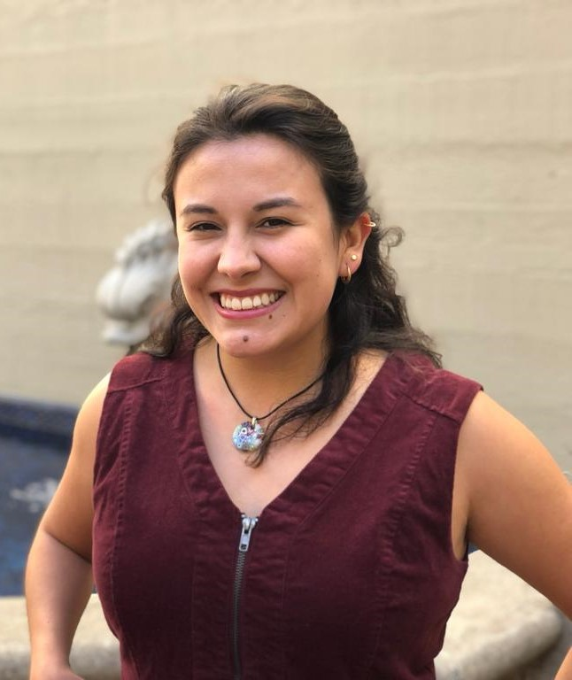

**Juana Montoya-Murillo**

I'm currently a Ph.D. student in Demography at UC Berkeley. My passion lies in using data to build a fairer society. I'm well-versed in advanced quantitative methods, including stats, econ, and demography, with a strong math foundation. I can apply various analysis techniques using tools like R and Python.
